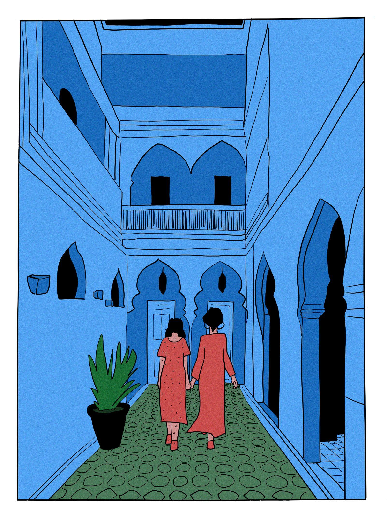
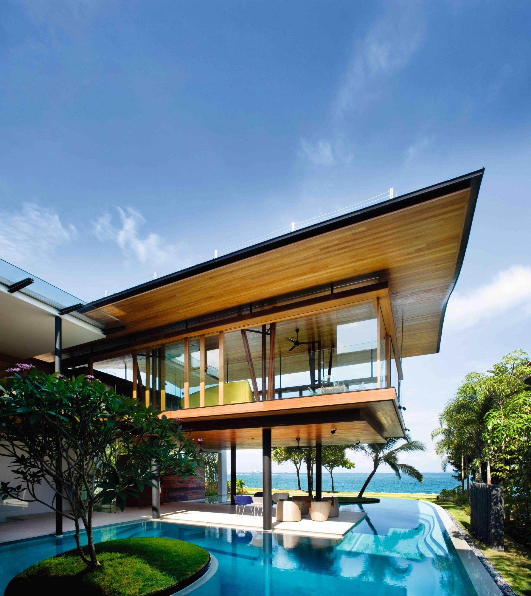

 

# C H E R I S H &nbsp; Y A N

### technology · art · ideas · life

 

  

&nbsp;

  

---

 

> **A student in China, looking for interesting things to build  
> and interesting places to live.**

---

# ABOUT

I'm a **junior student at Central South University**.

I like learning things that sit somewhere between
technology and everyday life.

I'm curious about how people build things,
how technology changes the way we live,
how design changes the way we see things,
and how economics explains the world underneath it all.

I don't really want to decide too early
what I'm supposed to become.

For now, I'd rather keep exploring.

---

# THINGS I'M CURIOUS ABOUT

<table>
<tr>

<td width="25%" align="center">

### `01`

## AI

Artificial intelligence  
AI-assisted development  
New ways of working

</td>

<td width="25%" align="center">

### `02`

## DESIGN

Web design  
Visual culture  
Digital products

</td>

<td width="25%" align="center">

### `03`

## ECONOMICS

Markets  
People  
Incentives  
How the world works

</td>

<td width="25%" align="center">

### `04`

## INTERNET

Web  
Open source  
Digital communities  
The future of work

</td>

</tr>

<tr>

<td width="25%" align="center">

### `05`

## CODE

Java  
Python  
Web development  
Automation

</td>

<td width="25%" align="center">

### `06`

## DATA

Visualization  
Information  
Patterns  
Stories

</td>

<td width="25%" align="center">

### `07`

## ART

Illustration  
Photography  
Visual design  
Museums

</td>

<td width="25%" align="center">

### `08`

## LIFE

Travel  
Books  
Cities  
The sea

</td>

</tr>
</table>

---

# MY CORNER OF THE INTERNET

&nbsp;&nbsp;

 

## `cherishyan.cn`

My personal website.

A small digital space for experiments,
ideas, visual projects and things I want to remember.

**Not a resume.**

More like a little corner of the Internet
that belongs to me.

 

<a href="https://cherishyan.cn">

### → ENTER CHERISHYAN.CN

</a>

---

# CURRENTLY

<table>
<tr>

<td width="33%" align="center">

### LEARNING

Java  
Python  
AI  
Web Development  
Figma

</td>

<td width="33%" align="center">

### EXPLORING

Digital Products  
Visual Design  
Data Visualization  
Economics  
Creative Technology

</td>

<td width="33%" align="center">

### BUILDING

Websites  
Small Tools  
Experiments  
Personal Projects  
Things I haven't named yet

</td>

</tr>
</table>

---

# A LIFE I'D LIKE TO TRY

 

## Singapore.

## Thailand.

## Or somewhere else.

 

Maybe one day I'll work remotely
from a small place near the sea.

A simple room.

A laptop.

Good internet.

A little balcony.

A coffee in the morning.

The ocean outside.

And enough freedom to decide
where I want to spend the next few months.

I don't necessarily want
to **travel all the time**.

I think I would rather have
a few places that I can slowly get to know.

Maybe Singapore for a while.

Maybe Thailand.

Maybe somewhere I've never heard of yet.

Work remotely.

Build things I care about.

Read.

Walk around.

Learn.

And see what happens.

---

# THE IDEA

 

## `LEARN → BUILD → SHIP → EXPLORE`

 

I don't have a perfectly defined career plan.

And I'm becoming increasingly okay with that.

I'd rather build a collection of skills,
projects and experiences that give me
more choices later.

Maybe that eventually becomes
a remote career.

Maybe a small digital product.

Maybe freelance work.

Maybe something I haven't thought of yet.

 

**The point is to keep the door open.**

---

# GITHUB

 

---

# CONTRIBUTION

---

# TOOLS

 

`JAVA` · `PYTHON` · `SPRING` · `SQL` · `GIT`

`WEB` · `AI` · `FIGMA` · `DATA` · `DESIGN`

---

# VISUAL NOTES

<table>
<tr>

<td width="33%">

</td>

<td width="33%">

</td>

<td width="33%">

</td>

</tr>

<tr>

<td width="33%">

</td>

<td width="33%">

</td>

<td width="33%">

</td>

</tr>
</table>

 

A few things I like.

Places.  
Images.  
Buildings.  
Books.  
Ideas.

---

 

# C H E R I S H

### keep building

 

  

Central South University · 2026

