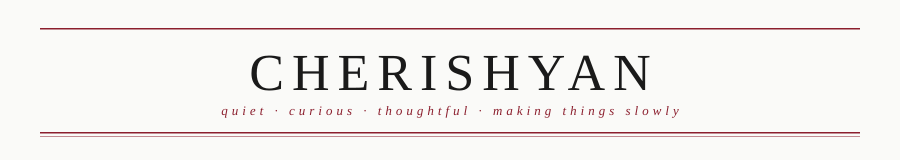
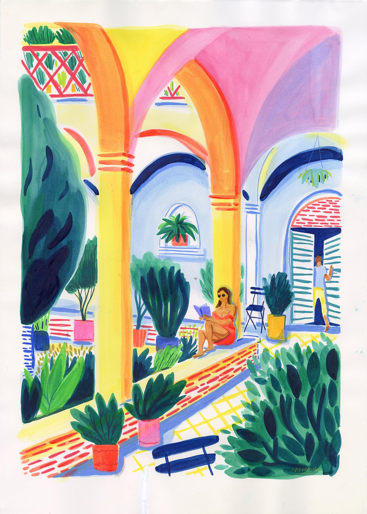
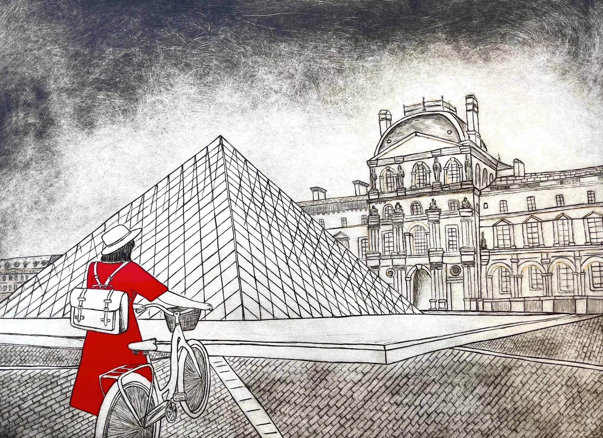
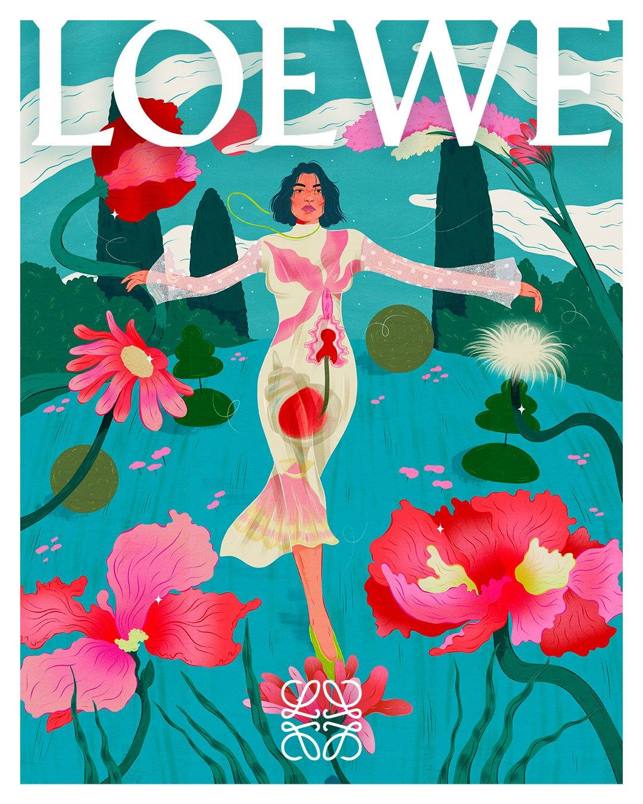
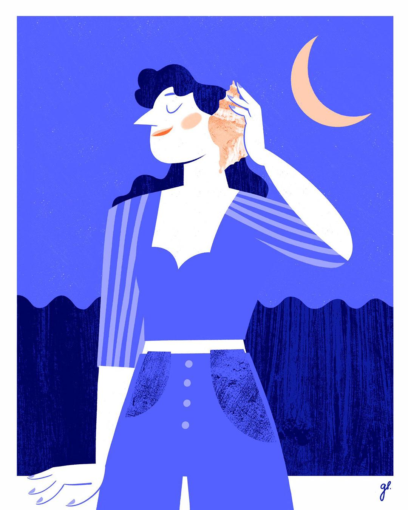
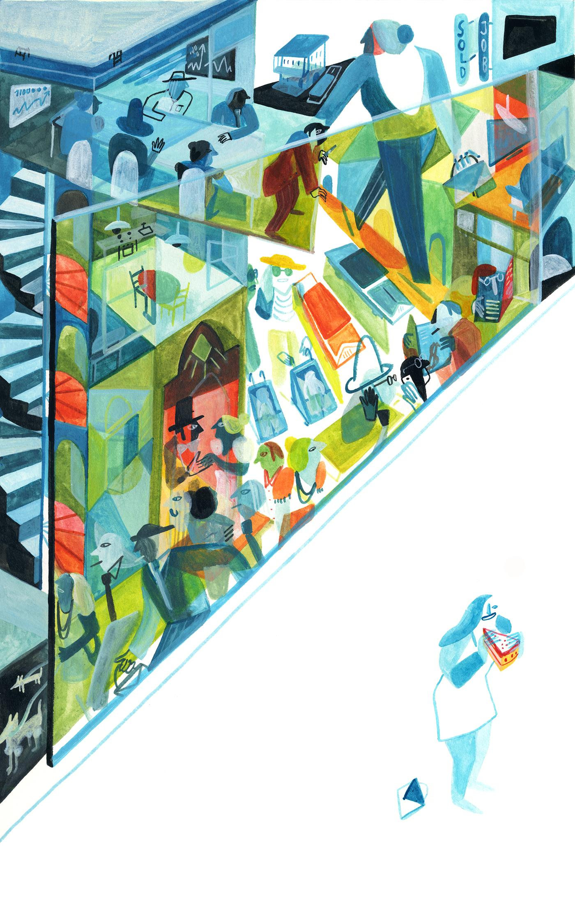
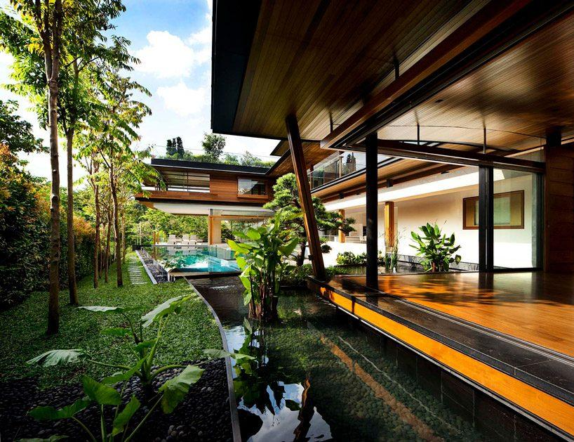
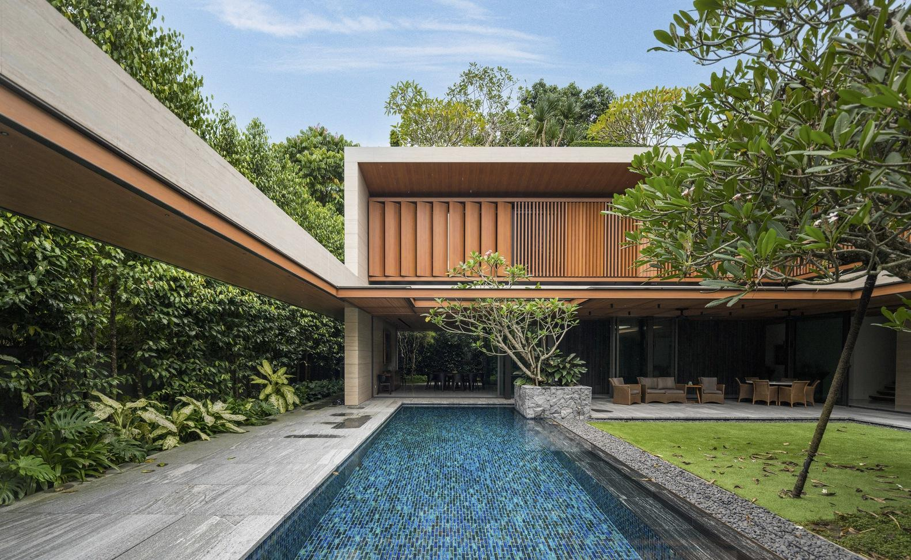
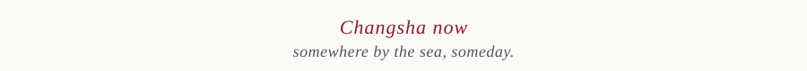

 

### 🌿 Welcome to my corner of the web

  &nbsp;
  &nbsp;
  

---

 

## 📍 About Me

<table>
<tr>
<td width="60%">

🎓 **Central South University** · Changsha, China

📚 **Passionate about:** Economics · History · Science · Philosophy

🔬 **Building:** Websites · Data Visualization · Optical Instruments

🎵 **Philosophy:** Life is for enjoying, not perfecting

</td>
<td width="40%">

  
  **Currently** 📖 Reading
  
  Economics & Notes
  
  **Location** 🏙️ Changsha
  
  **Future Dream** 🌊 By the sea, living remotely
  

</td>
</tr>
</table>

 

---

 

## 🚀 Projects in Progress

<table>
<tr>
<td width="50%">

### 🔭 Newtonian Telescope
**Building a real stargazing instrument**

Starting from basic optics → optical calculations → structural design → a telescope that actually works.

*Status:* 🟡 In Progress

</td>
<td width="50%">

### 📊 Data Visualization
**Making data beautiful and meaningful**

Focus on information structure and narrative, not just pretty charts. Let readers understand without effort.

*Status:* 🟡 In Progress

</td>
</tr>
<tr><td colspan="2"></td></tr>
<tr>
<td width="50%">

### 🌐 cherishyan.cn
**My digital home & creative lab**

Long-term maintained personal IP. A place where ideas become reality.

[Visit →](https://cherishyan.cn)

*Status:* 🟡 Ongoing

</td>
<td width="50%">

### 📚 Economics & Notes
**Thinking through books**

Reading economics and other fascinating topics. Collecting valuable thoughts, notes, and questions.

*Status:* 🟡 In Progress

</td>
</tr>
</table>

 

---

 

## 🛠️ Tech Stack

<em>Tools I'm using, not things I've mastered</em>

 

---

 

## 🎨 Gallery · Things Worth Keeping

*A small collection of beautiful, interesting, or meaningful moments*

  &nbsp;
  &nbsp;
  &nbsp;
  &nbsp;
  &nbsp;
  

 

---

 

## 🌊 Places & Dreams

*Destinations calling · A life by the sea*

  &nbsp;
  &nbsp;
  

 

---

 

## 💭 Let's Chat About

Interested in any of these? I'd love to hear from you:

> 🔭 Telescopes & Optics  
> 📈 Economics & Finance  
> 🎨 Information Design  
> 🌐 Beautiful Websites  
> 🏝️ Remote work by the sea

  

 

 

---

<em>Last updated: 2024</em>

