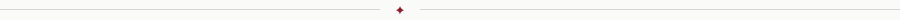

 

<a href="https://github.com/cherishyan">&nbsp; GitHub</a>&ensp;·&ensp;<a href="https://cherishyan.cn">&nbsp; Website</a>&ensp;·&ensp;<a href="mailto:lyan89806@gmail.com">&nbsp; Email</a>

 

 

### à propos

<table>
<tr>
<td width="60%" valign="top">

无聊的时候看看书打发时间，偶尔也会动手做一下小项目；

多听听音乐，事事不必美满，每天能开心快乐就行；

</td>
<td width="40%" valign="top">

<em>NOW &ensp;· Changsha, China</em> 
<em>STUDY · Central South University</em> 
<em>READ &ensp;· Economics · History · Science</em> 
<em>MAKE · Websites · Data · Optics</em>

</td>
</tr>
</table>

 

 

### projets en cours &nbsp;·&nbsp; *in progress*

<table>
<tr>
<td width="50%" valign="top">

**`01`&ensp;牛顿反射式天文望远镜**&ensp;*· in progress*

从基础光学开始研究，自己完成光学计算和结构设计，最终做出一台真正能用来看星星、看月亮的牛反望远镜。

</td>
<td width="50%" valign="top">

**`02`&ensp;数据可视化**&ensp;*· in progress*

把数据做得漂漂亮亮，让读者不需要费力就能看懂。重视信息的结构和叙事，而不只是图表好不好看。

</td>
</tr>
<tr><td colspan="2"> </td></tr>
<tr>
<td width="50%" valign="top">

**`03`&ensp;cherishyan.cn**&ensp;*· in progress*

长期维护、长期更新的个人 IP，也是我的赛博领地。&nbsp; [↗](https://cherishyan.cn)

</td>
<td width="50%" valign="top">

**`04`&ensp;Economics & Notes**&ensp;*· in progress*

阅读经济学与其他感兴趣的书，把真正值得留下来的思考、笔记和问题慢慢整理下来。

</td>
</tr>
</table>

 

 

### carnet &nbsp;·&nbsp; *tools I'm using, not things I've mastered*

 

 

### la galerie &nbsp;/&nbsp; *illustrations*

*A small collection of things I find beautiful, interesting, or worth keeping.*

  &nbsp;
  &nbsp;
  &nbsp;
  &nbsp;
  &nbsp;
  

 

 

### la galerie &nbsp;/&nbsp; *sea & nomad life*

*Places I want to see, and a life I want to live.* &nbsp; 想去的地方，和想过的生活。

  &nbsp;
  &nbsp;
  

 

 

### contact

想聊望远镜、经济学、信息设计、好看的网页，或者毕业以后去海边远程生活的可能性，欢迎写信。

&nbsp;

 

